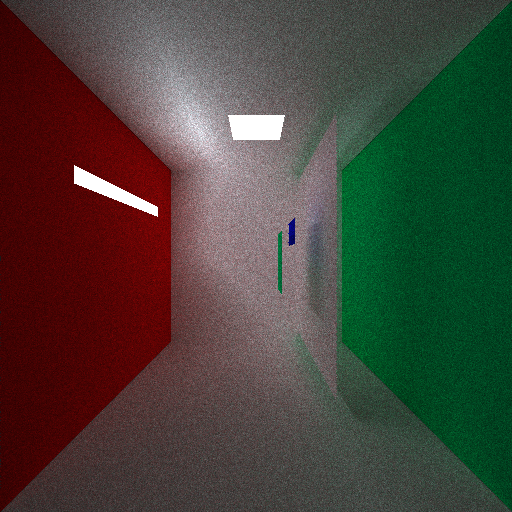

# pt (**p**ath **t**racer)
Simple software path tracer implementation in C99. Implementation isn't based of some tutorials or examples but of my own understanding of how a path tracer works, so there is a high chance that there are a lot of things which aren't correct.

## Example renderings

